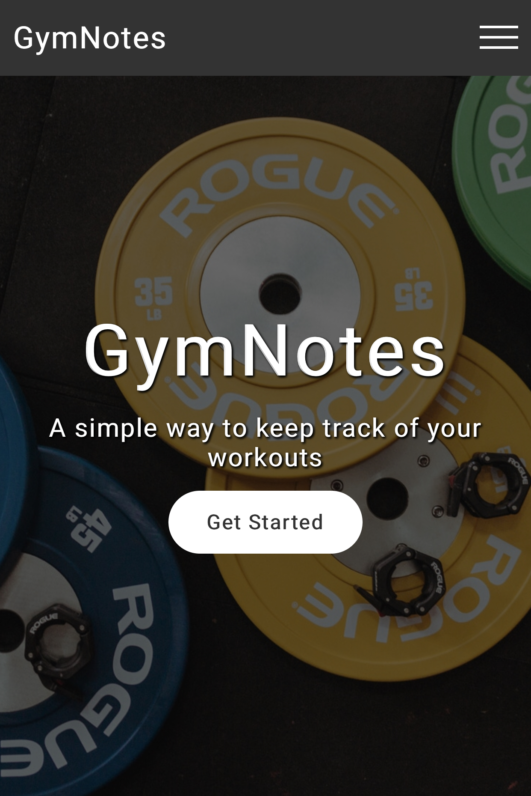
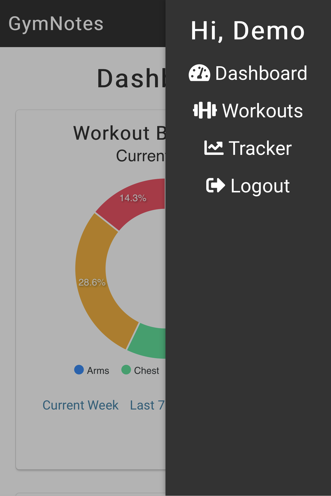
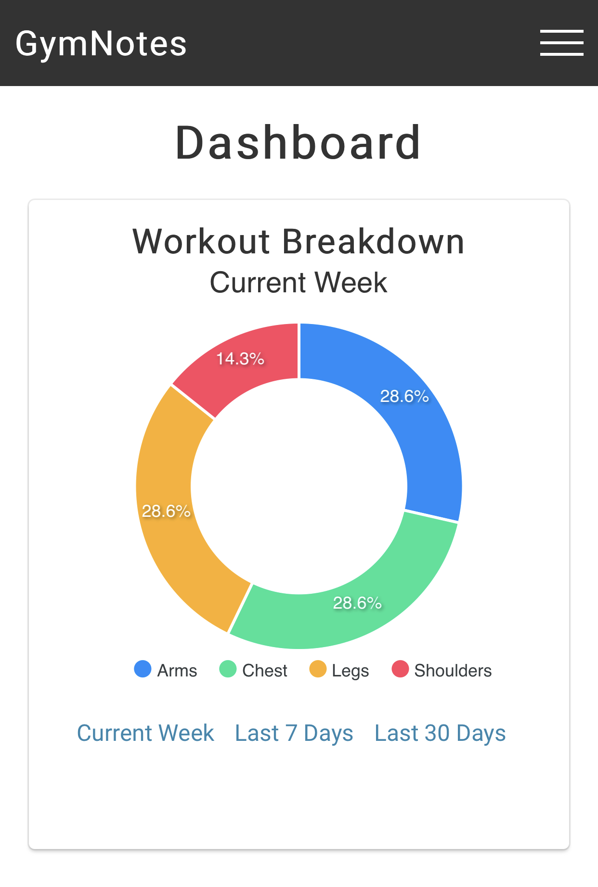
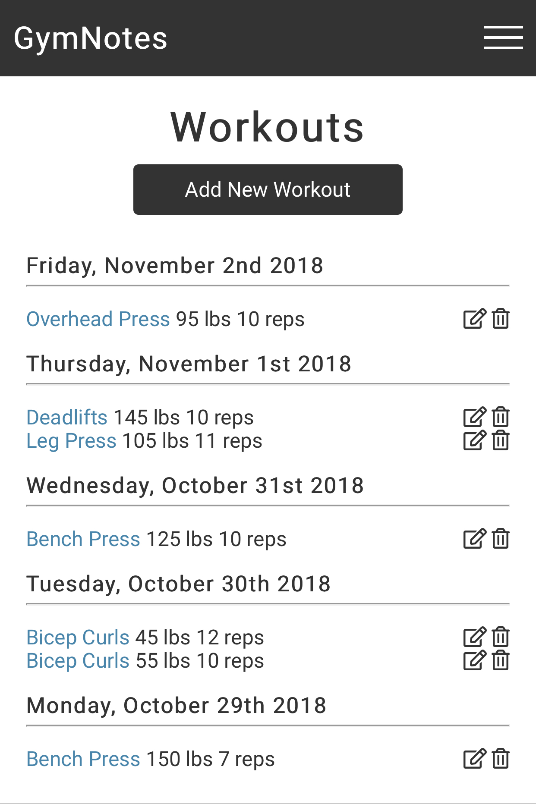
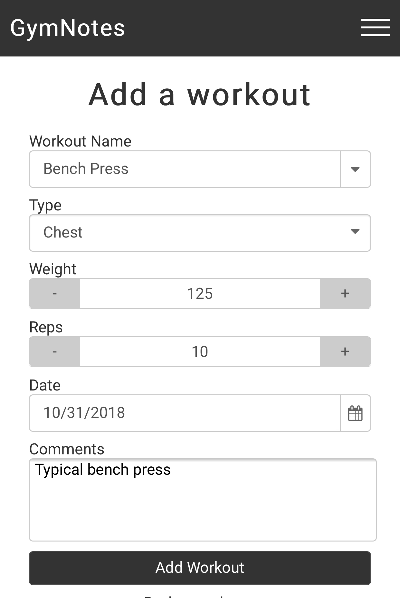
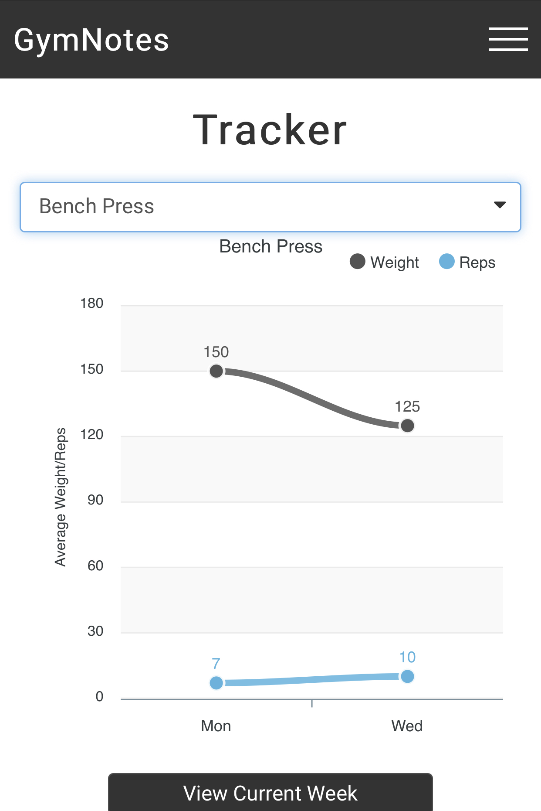

GymNotes 
====

A simple, way to track and log any weightlifting workouts
--------------------------------------

### [Live Link](https://gymnotes.herokuapp.com/) 
--------------------------------------------

Summary
=======
GymNotes is a full-stack application that allows users to log, view, edit, and delete weighlifting exercises. User have the ability to log workouts over time, tracking their progress through interactive breakdown and tracker charts. 

Screenshots
-----------

# Technologies

## Frontend
  * HTML5
  * CSS3
  * Javascript
  * React
  * Redux
  * ApexCharts

## Backend
  * Node.js
  * Express.js
  * Passport
  * Mongoose

## Testing
  * Mocha
  * Chai
  * Faker
  * Cheerio
  * Travis CI

# Hosted on
  Heroku

# Future Features
 * Improved Workout Organization
 * Additional Workout Types
 * Staring/Favoriting Workouts
